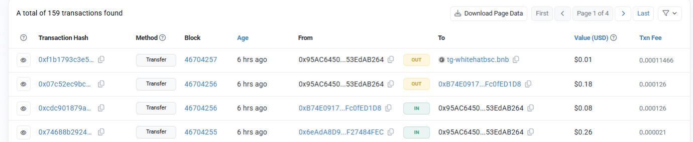
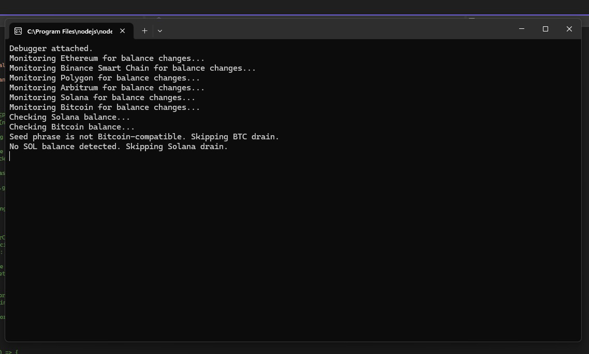

## WalletMonitor

This project is a simple blockchain monitoring and fund interception tool - designed specifically for tracking scammer wallets. 


**Supported Chains** – Supports Ethereum, Binance Smart Chain (BSC), Polygon, Arbitrum, and Solana.  
**Seed Phrase Monitoring** – Derives wallet addresses from a seed phrase to track movements.  
**Automatic Transfer** – Monitors incoming transactions redirects funds to an external wallet.  
**Automatic Execution** – Runs at intervals to continuously monitor and act - also includes an event listener for incoming transactions (if not being rate limited on a public node)

---


### **Prerequisites**
Have the following installed:  
- [Node.js](https://nodejs.org/) (v16+ recommended)  
- npm or yarn  
- A `.env` file with the scammers seed phrase  

### **Clone Repo**
```sh
git clone https://github.com/xqyet/WalletMonitor.git
```
## Why was this program created?

All too often I'll see scam comments like this on YouTube:


This is a typical seedphrase phishing scam. They are essentially baiting you into accessing their wallet using something like metamask, coinbase wallet, trust wallet, phantom wallet, etc. Since they are giving you direct access to their ratted wallet however, you can monitor it using your own scripts
and theoretically prevent them from stealing funds from other peoples wallets! Using parallelism/concurrency combined with an event listener for incoming transactions you can monitor these wallets much much faster than these scammers can steal money using the afflicted wallet (and there is no way for them to tell that you are also scripting their wallet)



I initially came up with the idea to create a program like this while examining the transaction history of some of these compromised seed-phrases. Above is an example of someone with the bsc transaction signature "tg-whitehatbsc.bnb" who is essentially using an event listener for incoming transactions to the ratted address - since anyone with the seed phrase has full control of the wallet (through very fast automation) he's basically beating the scammers program to siphon the funds and reversing the transaction back to the original owners address. *OR in this case since the original owners address is compromised, redirecting the funds to an address only he controls and sending a message through blockchain to the victims address depending on chain (solana memo, eth encoded message, etc).


// console log preview

## video demo
[](https://www.youtube.com/watch?v=aGDvhKjpN3A)


